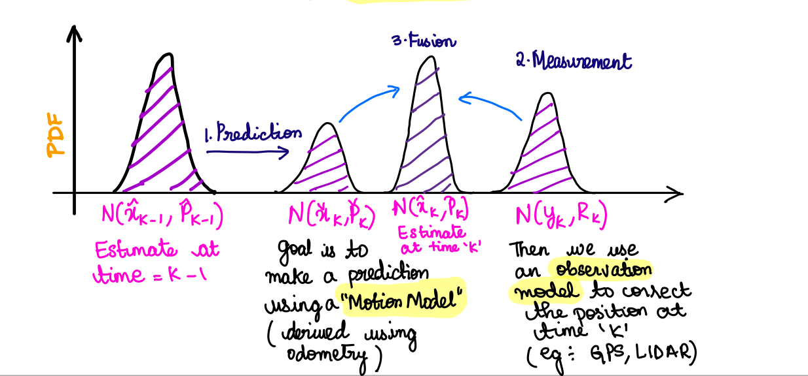
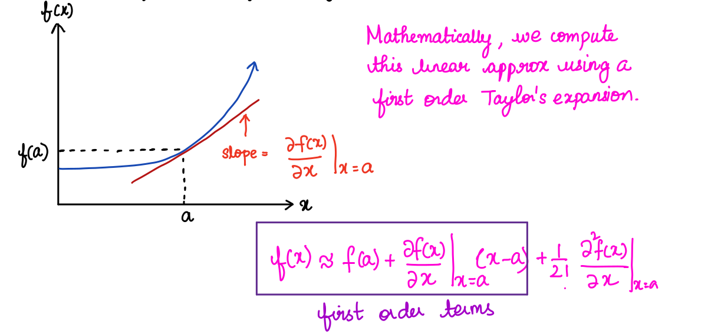
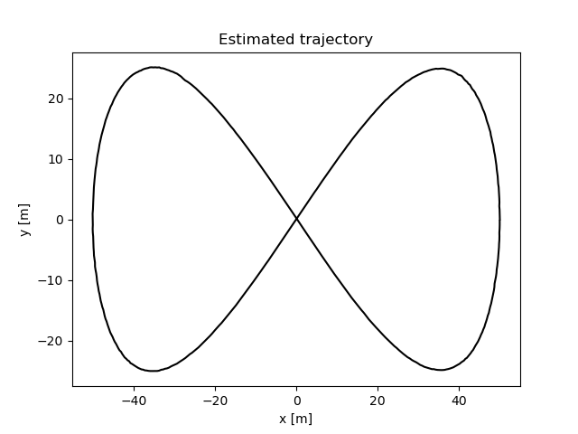
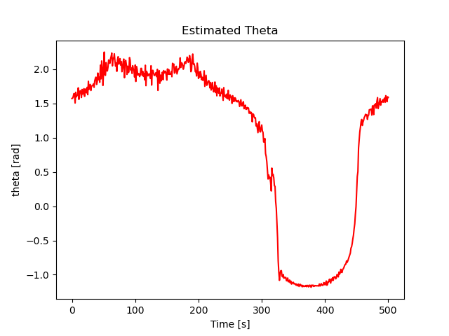

# Extended Kalman Filter 

This repository contains code for EKF implementation in python for an open source Lidar data. 

The Goal of a Kalman Filter is to take a Probabilistic Estimate of the state and update it in real time in two steps, Prediction and Correction Step.

​                                                  
​     

#### A. Linearizing a Non Linear Function
In 2D, Choose an operating point 'a' approximate the non-linear function by a tangent line at the point. 





For EKF we choose the operating point to be our most recent state estimate, our known input and zero noise. 


We will be computing the Jacobians of the Non-Linear Measurement and Motion Model w.r.t the posterior state and the noise.

In vector calculus jacobian matrix is the matrix of all first order partial derivatives of a vector values function. 

Intuitively the Jacobian matrix tells you how fast each output of the function is changing along each input direction.

For Example : 


$$
f(x) = \begin{bmatrix} f_1 \\ f_2 \end{bmatrix} = \begin{bmatrix} x_1 + x_2 \\ x_1^2 \end{bmatrix} = \begin{bmatrix} \frac {\partial f_1} {\partial x_1} &&  \frac {\partial f_1} {\partial x_2} \\ \frac {\partial f_2} {\partial x_1} && \frac {\partial f_2} {\partial x_2} \end{bmatrix} = \begin{bmatrix} 1 && 1  \\ 2x_1 && 0 \end{bmatrix}
$$


#### A1. Linearized Motion Model 

Using Jacobians we linearize the non-linear motion model. 
$$
x_k = f_{x-1} (\hat{x}, u_{k-1}, 0) + F_{k-1}(x_{k-1}-\hat{x}_{k-1}) + L_{k-1} w_{k-1}
$$

#### A2. Linearized Measurement Model 

Using Jacobians we linearize the non-linear motion model. 
$$
y_k = h_k (\check{x}_{k-1},0) + H_k(x_k - \check{x}_{k-1}) + M_kV_k
$$

#### Prediction Step :   

$$
\check{x}_k = f_{k-1}(\hat{x}_{k-1},u_{k-1},0)  \\
\check{P}_k = F_{k-1}\hat{P}_{k-1}F^T_{k-1} + L_{k-1} Q_{k-1}L^T_{k-1}
$$

#### Optimal Gain : 

$$
K_k = \check{P}_k H^T_k(H_k \check{P}_k H^T_k + M_kR_kM^T_k)^{-1}
$$

#### Correction : 

$$
\hat{x}_k = \check{x}_k + K_k (y_k - h_k(\hat{x},0)) \\
\hat{P}_k = (I - K_kH_k)\check{P}_k
$$


#### Further Information about EKF can be found in the file (Nonlinear Kalman Filter - Extended Kalman Filter.pdf)


## Data :

##### The data contains lidar and control inputs information (linear and angular velocity).


## Setup : 

### Step 1 : Setting up Perquisites 

```
pip install numpy 
pip install matplotlib
pip install pickle
pip install matplotlib
pip install easydict
```

### Step 2 : Setting up parameters in the yaml file.

Setup the variance, data file path and other parameters in the yaml file. 

### Step 3 : Running main.py 

```
python main.py 
```


## Results : 

     


